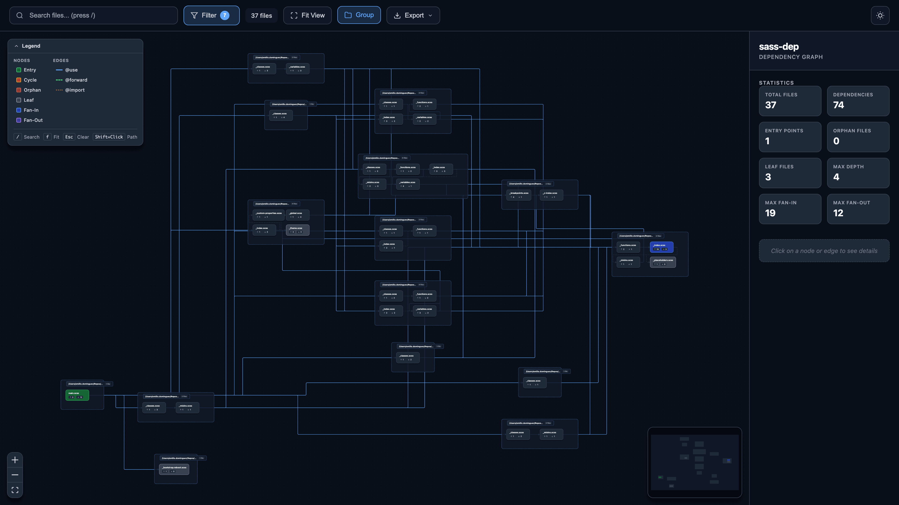

# sass-dep

A Rust CLI tool for analyzing SCSS codebases and building file-level dependency graphs.

[](https://opensource.org/licenses/MIT)

## Overview

`sass-dep` parses SCSS files to extract `@use`, `@forward`, and `@import` directives, resolves paths according to Sass conventions, and builds a directed dependency graph that can be analyzed for cycles, metrics, and other structural properties.

## Features

-   **Dependency Graph Construction** - Build a complete file-level dependency graph from entry points
-   **Cycle Detection** - Identify circular dependencies using Tarjan's algorithm
-   **Metrics Calculation** - Compute fan-in, fan-out, depth, and transitive dependencies
-   **Multiple Output Formats** - Export to JSON, Graphviz DOT, Mermaid, or D2
-   **CI Integration** - Check command for enforcing constraints in pipelines
-   **Interactive Web Visualizer** - React-based UI for exploring dependency graphs



## Installation

### From Source

```bash
git clone https://github.com/emiliodominguez/sass-dep.git
cd sass-dep
cargo install --path .
```

### Using Cargo

```bash
cargo install sass-dep
```

## Quick Start

Analyze an SCSS project:

```bash
# Basic analysis with JSON output
sass-dep analyze src/main.scss

# Output to file
sass-dep analyze src/main.scss --output deps.json

# Include orphan files
sass-dep analyze src/main.scss --include-orphans

# Check for issues in CI
sass-dep check src/main.scss --no-cycles --max-depth 10
```

## CLI Reference

### Global Options

| Option              | Short | Description                                  |
| ------------------- | ----- | -------------------------------------------- |
| `--root <DIR>`      |       | Project root directory (default: `.`)        |
| `--config <FILE>`   |       | Config file path (default: `.sass-dep.toml`) |
| `--load-path <DIR>` | `-I`  | Add Sass load path (can be repeated)         |
| `--quiet`           | `-q`  | Suppress non-error output                    |
| `--verbose`         | `-v`  | Increase verbosity (-v, -vv, -vvv)           |

### Commands

#### `analyze`

Build dependency graph and run analysis.

```bash
sass-dep analyze [OPTIONS] <ENTRY_POINTS>...
```

**Options:**

| Option              | Short | Description                                   |
| ------------------- | ----- | --------------------------------------------- |
| `--output <FILE>`   | `-o`  | Output file (default: stdout)                 |
| `--format <FORMAT>` |       | Output format: `json` (default)               |
| `--include-orphans` |       | Include files not reachable from entry points |

**Examples:**

```bash
# Analyze single entry point
sass-dep analyze src/main.scss

# Analyze multiple entry points
sass-dep analyze src/app.scss src/admin.scss

# With load paths
sass-dep analyze -I node_modules -I vendor src/main.scss

# Output to file
sass-dep analyze src/main.scss -o analysis.json
```

#### `check`

Verify graph integrity (CI mode). Exits with code 1 if constraints are violated.

```bash
sass-dep check [OPTIONS] <ENTRY_POINTS>...
```

**Options:**

| Option              | Description                                |
| ------------------- | ------------------------------------------ |
| `--no-cycles`       | Fail if circular dependencies are detected |
| `--max-depth <N>`   | Maximum allowed depth in dependency tree   |
| `--max-fan-out <N>` | Maximum allowed direct dependencies        |
| `--max-fan-in <N>`  | Maximum allowed dependents                 |

**Examples:**

```bash
# Fail on cycles
sass-dep check --no-cycles src/main.scss

# Enforce depth limit
sass-dep check --max-depth 5 src/main.scss

# Multiple constraints
sass-dep check --no-cycles --max-depth 10 --max-fan-out 15 src/main.scss
```

#### `export`

Convert JSON analysis to visualization formats.

```bash
sass-dep export [OPTIONS] <INPUT>
```

**Options:**

| Option              | Description                                            |
| ------------------- | ------------------------------------------------------ |
| `--format <FORMAT>` | Export format: `dot`, `mermaid`, `d2` (default: `dot`) |

**Examples:**

```bash
# Export to Graphviz DOT
sass-dep export analysis.json --format dot > graph.dot
dot -Tpng graph.dot -o graph.png

# Export to Mermaid
sass-dep export analysis.json --format mermaid > graph.mmd

# Export to D2
sass-dep export analysis.json --format d2 > graph.d2
d2 graph.d2 graph.svg
```

## JSON Schema

The analysis output follows a versioned JSON schema (v1.0.0):

```json
{
	"$schema": "https://github.com/emiliodominguez/sass-dep/blob/main/schema/v1.0.0.json",
	"version": "1.0.0",
	"metadata": {
		"generated_at": "2024-01-15T10:30:00Z",
		"root": "/project",
		"sass_dep_version": "0.1.0"
	},
	"nodes": {
		"src/main.scss": {
			"path": "/project/src/main.scss",
			"metrics": {
				"fan_in": 0,
				"fan_out": 3,
				"depth": 0,
				"transitive_deps": 5
			},
			"flags": ["entry_point"]
		}
	},
	"edges": [
		{
			"from": "src/main.scss",
			"to": "src/_variables.scss",
			"directive_type": "use",
			"location": { "line": 1, "column": 1 },
			"namespace": "vars"
		}
	],
	"analysis": {
		"cycles": [],
		"statistics": {
			"total_files": 10,
			"total_dependencies": 15,
			"entry_points": 1,
			"orphan_files": 2,
			"leaf_files": 4,
			"max_depth": 5,
			"max_fan_in": 3,
			"max_fan_out": 4
		}
	}
}
```

### Node Flags

| Flag           | Description                             |
| -------------- | --------------------------------------- |
| `entry_point`  | File specified as an entry point        |
| `leaf`         | File with no dependencies (fan-out = 0) |
| `orphan`       | File not reachable from any entry point |
| `high_fan_in`  | Fan-in exceeds threshold (default: 5)   |
| `high_fan_out` | Fan-out exceeds threshold (default: 10) |
| `in_cycle`     | File is part of a circular dependency   |

### Edge Types

| Type      | Description                  |
| --------- | ---------------------------- |
| `use`     | `@use` directive             |
| `forward` | `@forward` directive         |
| `import`  | `@import` directive (legacy) |

## Configuration

Create a `.sass-dep.toml` file in your project root:

```toml
# Load paths for module resolution
load_paths = ["node_modules", "vendor"]

# File extensions to consider
extensions = ["scss", "sass"]

# Analysis thresholds
[thresholds]
high_fan_in = 5
high_fan_out = 10
```

## Exit Codes

| Code | Description                        |
| ---- | ---------------------------------- |
| 0    | Success                            |
| 1    | Check command found violations     |
| 2    | Invalid arguments or configuration |
| 3    | File not found or IO error         |
| 4    | Parse error                        |

## Web Visualizer

The project includes an interactive web-based visualizer for exploring dependency graphs. Located in the `web/` directory, it's a React application built with Vite and React Flow.

### Running the Visualizer

```bash
cd web
npm install
npm run dev
```

Open `http://localhost:5173` and load your JSON analysis file (drag & drop or file picker).

### Visualizer Features

**Graph Interaction**

-   Pan and zoom with mouse/trackpad
-   Click nodes to view details in sidebar
-   Shift+click two nodes to highlight the path between them
-   Use search (`/`) to filter nodes by name or path

**Filtering & Search**

-   Filter by node flags (entry point, leaf, orphan, in cycle, high fan-in/out)
-   Advanced filtering by depth, fan-in, and fan-out ranges
-   Real-time node count showing visible/total

**Cycle Detection**

-   Toggle cycle highlighting to visualize circular dependencies
-   Animated pulse effect on nodes and edges in cycles

**Impact Analysis**

-   View direct dependents (files that import selected file)
-   View direct dependencies (files imported by selected file)
-   Expandable dependency trees showing transitive relationships

**Export Options**

-   PNG - High-resolution image export
-   SVG - Vector format for editing
-   JSON - Export filtered subgraph data

**Folder Grouping**

-   Toggle folder grouping to organize files by directory
-   Visual containers show folder path and file count
-   Group backgrounds dim edges for clearer visualization
-   Hover labels to expand and see full folder paths

**Keyboard Shortcuts**
| Key | Action |
|-----|--------|
| `/` | Focus search input |
| `f` | Fit graph to view |
| `Esc` | Clear search/selection |
| `Shift+Click` | Select path endpoints |

### Visualizer Tech Stack

-   React 18 with TypeScript
-   React Flow (@xyflow/react) for graph rendering
-   Vite for development and building
-   html-to-image for PNG/SVG export

## Non-Goals

This tool intentionally does not:

-   Track variables, mixins, or functions
-   Analyze CSS output
-   Support watch mode
-   Handle remote imports
-   Support Sass indented syntax
-   Handle package imports (`pkg:` protocol)

## Contributing

Contributions are welcome! Please:

1. Fork the repository
2. Run `./setup.sh` to configure git hooks and install dependencies
3. Create a feature branch
4. Submit a pull request

## License

MIT License - see [LICENSE](LICENSE) for details.
